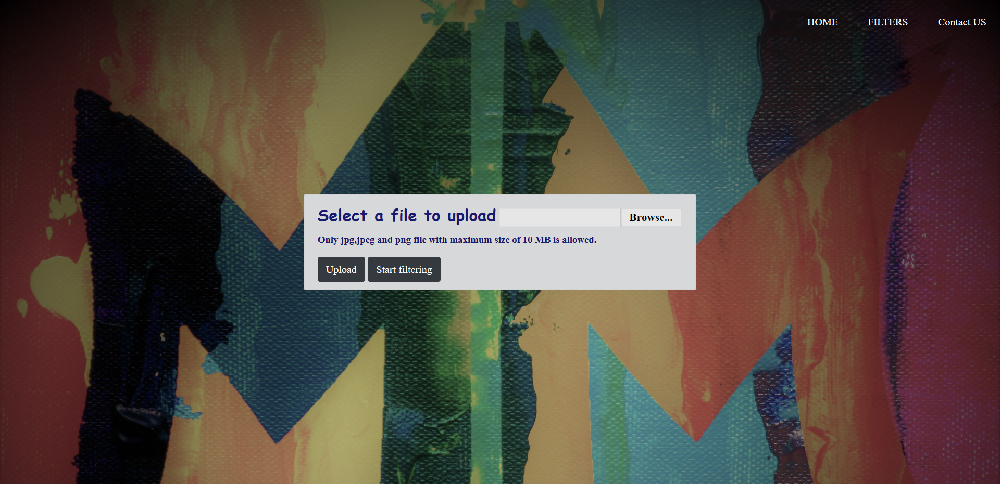
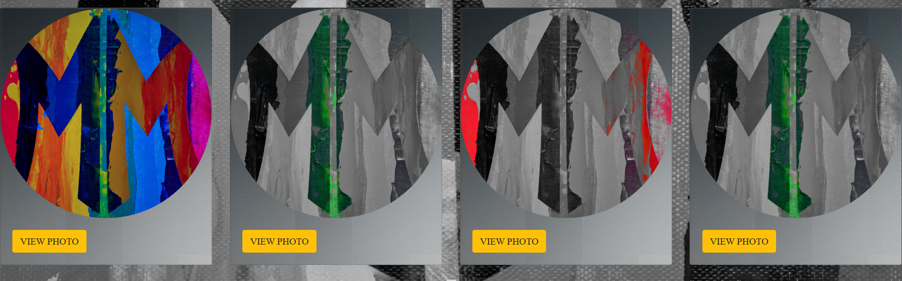
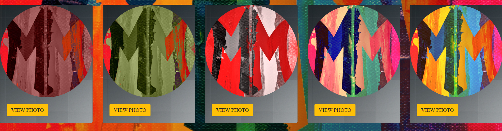
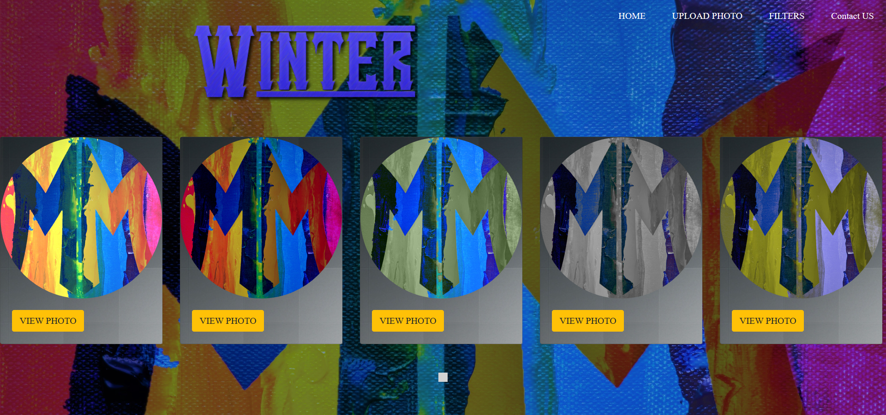
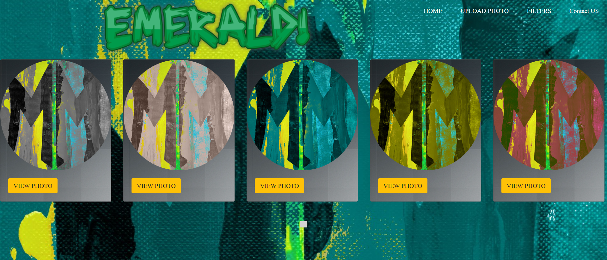

# M & M FILTERS WEBSITE

M & M is a new website for editing photos and always under update to add many new features.
Here you are the archtict of Your LIFE!

  - M & M Uses HTML5 , CSS and BootStrap for the Front-End styles .
  - M & M Uses JavaScript and php for the Back-End functionality .

### New Features!

  > Upload a photo and see the magic happens on it .
  
  
  

  > GrayScales .
  
  
  

  > warm .
  
  
  

  > cool .
  
  
  
  > More filters in our website .
  
  
  
