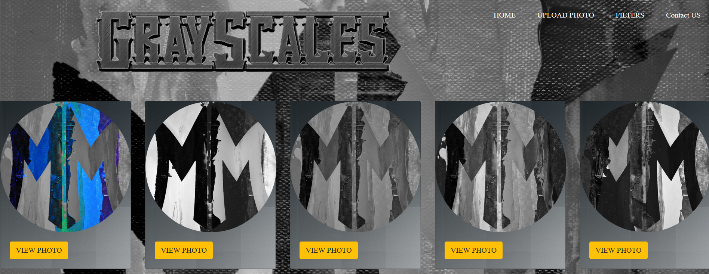

# M & M FILTERS WEBSITE

* M & M is a new website for editing photos and always under update to add many new features.
Here you are the archtict of Your LIFE!

## Project Features

  * Upload a photo and see the magic happens on it .
  > Only jpg,jpeg and png file with maximum size of 10 MB is allowed.
  
  
  

  * GrayScales .
  
  
  

  * warm .
  
  
  

  * cool .
  
  
  
  * More filters in our website .
  
  
  
  
## Tech

This project uses four of the web programming languages :
 
 - M & M Uses HTML5 , CSS and BootStrap for the Front-End styles .
 - M & M Uses JavaScript and php for the Back-End functionality .
 > PHP : For uploading the image file to the server .
 
 > JavaScript : For filters codes . 

## Requirements

 Any Web Development IDE that supports HTML5 , CSS , JavaScript and PHP .
 
 you may try : 
 * [NetBeans](https://netbeans.org/) - NetBeans is high on the list for the best web development IDE because it is easy to use and it lets you develop cool desktop, mobile, and web apps in no time. It works equally as good with JavaScript, HTML5, PHP, C/C++ etc. It is a free JavaScript IDE and a great HTML5 IDE for your day-to-day use.
 
* NetBeans needs [XAMPP](https://www.apachefriends.org/download.html)  to run PHP . - XAMPP is the most famous PHP and Perl development environment. It helps developers to setup a local server which is fully equipped with all necessary tools and helps them to work at high speed. It is a totally free, very simple in installing Apache distribution containing Maria DB (MySQL), PHP, and Perl. The set up of the the package is extremely easy for multiple operating systems like Windows, Linux, Mac OS X and Solaris.
